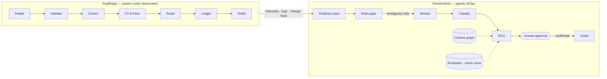

# PayBridge + FlowSentinel

**An agentic AIOps layer for a real-time cross-border payments pipeline.**

FlowSentinel watches the PayBridge payment pipeline, reconciles payment counts and values between stages, diagnoses failures, and raises tickets under human approval.

> **Status: work in progress.** M1 (pipeline simulator) started October 2026. Target for a public MVP: 31 December 2026. See [Roadmap](#roadmap).

---

## The problem

Payment operations teams find out about failures late. Dashboards show counts, not money, and every stage looks healthy on its own while payments go missing, get duplicated, or post at the wrong value between stages. Finding the cause means manual reconciliation across systems.

FlowSentinel treats **payment reconciliation as the detection model**:

- counts and values must be conserved between stages, after a settling window
- value is reconciled **per currency leg**, because FX is the only stage that changes currency
- money sent on the rail must equal money posted to the ledger, to the minor unit
- every posted payment has exactly one idempotency key; a repeated key means a duplicate payment

Deterministic rules detect the break. Agents work out **where** it happened, **why**, and **who** should fix it. A human approves before anything is written.

---

## Architecture



| Layer | What it does | MVP implementation |
|---|---|---|
| System under observation | 7-stage payment pipeline with injectable failures | Python simulator over SQLite topics |
| Ingestion | Collects telemetry, logs and changes into one evidence pack; masks PII | Collectors + time alignment |
| Context & knowledge | Stages, dependencies, balance rules, owners; runbooks for retrieval | Embedded graph + sqlite-vec |
| Tools | Read-only tools plus one gated write | Own MCP server |
| Orchestration | Rules gate → Monitor → Classify → RCA, with checkpoints and a human interrupt | LangGraph |
| Evaluation | Scores every diagnosis against injected ground truth | pytest harness, gated in CI |

Agent code depends only on interfaces (ports). The same agents are planned to run on a heavier stack in 2027 (Java services, Redpanda, Postgres, Neo4j) by swapping adapters, not rewriting agents.

---

## Design principles

- **Rules first, model second.** Deterministic checks run before any model call.
- **Read-only by default.** The only write in the MVP is a ticket, after a human confirms.
- **Honesty over answers.** "Something is wrong and I don't know why" is a valid, measured output.
- **Configuration over code.** Stages, rules, tolerances and owners live in [`pipeline.yaml`](pipeline.yaml).
- **Evaluation before tuning.** The harness exists before prompts are tuned.
- **Autonomy is earned.** Per action type, from a measured track record.

---

## Repository

```
contracts/          payment event contract (JSON Schema) and example
pipeline.yaml       stages, topics, balance rules, tolerances, owners, failure types
docs/
  decisions.md      decision log
  adr/              architecture decision records
  BUILD_LOG.md      daily build log
flowsentinel/       Python package
  sim/              PayBridge simulator, failure injectors, ground truth   (M1)
  graph/            context graph loader and queries                       (M2)
  ingest/           collectors, evidence pack, runbook indexing            (M3)
  agents/           monitor, classify, rca, llm client, prompts            (M4)
  orchestration/    LangGraph flow, checkpointer, interrupts               (M4)
  console/          Streamlit approval console                             (M4)
  tickets/          ticket service stub                                    (M4)
tests/              unit tests and evaluation scenarios                    (M5)
```

Key files: [`contracts/payment.v1.schema.json`](contracts/payment.v1.schema.json) · [`pipeline.yaml`](pipeline.yaml) · [`docs/decisions.md`](docs/decisions.md)

---

## Roadmap

| Phase | Dates | Delivers | Status |
|---|---|---|---|
| M1 · Pipeline to break | Oct 2026 | 7-stage simulator, 5 failure injectors, ground truth per run | In progress |
| M2 · Context graph | Oct–Nov 2026 | `pipeline.yaml` → graph; dependency and blast-radius queries | — |
| M3 · Ingestion & knowledge | Nov 2026 | Evidence pack, PII masking, runbook retrieval, MCP server | — |
| M4 · Agents & human gate | Nov–Dec 2026 | Rules gate, three agents, checkpoints, approval console | — |
| M5 · Evaluate & ship | Dec 2026 | ~30 scenarios, metrics, CI eval gate, soak run | — |

---

## Evaluation

The README will report **measured numbers only**, from a reproducible harness:

| Metric | Question it answers |
|---|---|
| Stage accuracy | Did it name the correct stage? |
| Category accuracy | Did it assign the correct failure category? |
| Suppression rate | Were clean runs correctly left alone? |
| Honesty rate | When no cause was determinable, did it say so? |
| Calibration | Does 80% confidence mean right about 80% of the time? |
| Retrieval recall@k | Was the right runbook retrieved? |
| Cost per incident | Model calls and tokens per diagnosed incident |

Results: *pending (M5).*

---

## Stand-ins and limits

Stated up front:

- **SQLite tables stand in for Kafka.** Ordering, offsets, replay and lag are kept. Partitions, replication and consumer-group rebalancing are not.
- **The payment pipeline is a Python simulator** with synthetic data, not real payment services.
- **Single process, single machine.** No claims about scale or concurrency.
- **Embedded graph and vector stores**, no authentication, no production observability backend.
- **Free-tier model APIs only.** Results depend on those models and are reported with the model versions used.

---

## Running it

*Setup instructions will be added as M1 lands.* Requirements: Python 3.13, Windows/macOS/Linux, no paid services.

---

## License

See [LICENSE](LICENSE).
